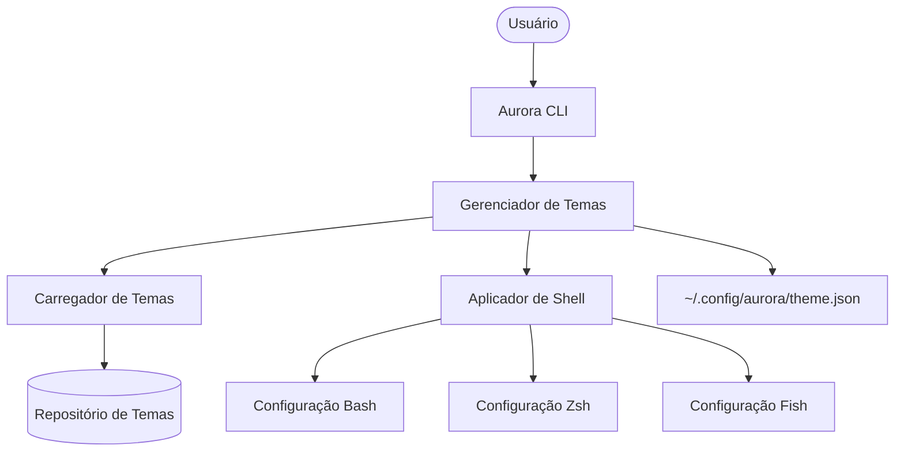

# Arquitetura do Aurora

## Componentes Internos

- **Aurora CLI**: O ponto de entrada para todas as interações do usuário.
- **Gerenciador de Temas**: Orquestra o carregamento, aplicação e persistência dos temas.
- **Carregador de Temas**: Escaneia o diretório `themes/` em busca de definições de temas válidas (.json ou .yaml).
- **Aplicador de Shell**: Responsável por traduzir as cores do tema em configurações específicas do shell (códigos de escape ANSI).
- **Controlador de Estado**: Gerencia o estado atual do tema para garantir consistência entre as sessões.

## Fluxo de Execução

1. O usuário executa `aurora apply <nome>`.
2. O **Carregador de Temas** recupera a definição do tema.
3. O **Aplicador de Shell** gera os comandos de shell necessários.
4. O **Controlador de Estado** atualiza o arquivo de persistência.
5. As cores do terminal mudam instantaneamente.
